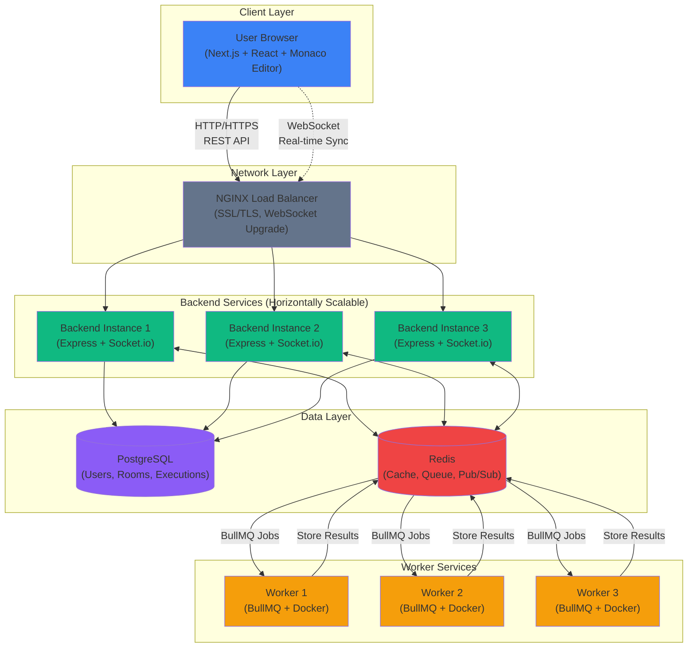

# High-Level Design Diagram Prompt for CodeMitra

## System Overview
Create a comprehensive high-level architecture diagram for **CodeMitra**, a real-time collaborative coding platform (similar to Google Docs for code). The system enables multiple users to simultaneously edit code, execute programs in various languages, and see real-time updates.

---

## Core Components to Include

### 1. Client Layer (Frontend)
- **Next.js 15 Web Application**
  - React 18 components
  - Monaco Editor (VS Code editor component)
  - Socket.io Client for real-time communication
  - State management (React Context)
  - Tailwind CSS for styling
- **User Browser**
  - WebSocket connections
  - HTTP/HTTPS requests
  - Real-time UI updates

### 2. API Gateway / Load Balancer
- **NGINX Reverse Proxy**
  - SSL/TLS termination
  - Load balancing across backend instances
  - WebSocket upgrade support
  - Static file serving

### 3. Backend Services Layer

#### A. Main Backend Server (Node.js + Express)
- **REST API Server**
  - Authentication endpoints (JWT)
  - Room management CRUD
  - User management
  - Code execution coordination
- **Socket.io Server**
  - Real-time code synchronization
  - Room presence management
  - Broadcast system
  - Redis adapter for horizontal scaling
- **Middleware Stack**
  - JWT authentication
  - Rate limiting
  - Error handling
  - CORS configuration

#### B. Worker Service
- **BullMQ Background Jobs**
  - Code execution queue
  - Job processing
  - Retry logic
- **Docker Runtime Executor**
  - Isolated container execution
  - Multi-language support (JavaScript, Python, Java, C++)
  - Security sandboxing
  - Resource limits (CPU, memory, timeout)

### 4. Data Layer

#### A. PostgreSQL Database
- **Tables**:
  - Users (authentication data)
  - Rooms (collaborative sessions)
  - RoomParticipants (many-to-many relationship)
  - CodeExecutions (execution history)
- **Features**:
  - Prisma ORM
  - Connection pooling
  - ACID transactions
  - Indexes on frequently queried columns

#### B. Redis Cache & Message Broker
- **Use Cases**:
  - Session caching
  - Room data caching (5-minute TTL)
  - Rate limiting counters
  - BullMQ job queue
  - Socket.io pub/sub adapter (multi-server scaling)
  - Temporary execution result storage

### 5. External Services (Optional)
- **Docker Hub** (for runtime images)
- **Monitoring** (Sentry for error tracking)
- **CDN** (Cloudflare for static assets)

---

## Data Flow Scenarios

### Flow 1: User Authentication
```
User → Frontend → NGINX → Backend API → PostgreSQL
                                ↓
                         Generate JWT Token
                                ↓
                    Store session in Redis (optional)
                                ↓
                    Return token to Frontend
```

### Flow 2: Real-Time Code Collaboration
```
User A types code → Frontend → WebSocket → Backend Socket.io Server
                                                    ↓
                                            Redis Pub/Sub Adapter
                                                    ↓
                                    Broadcast to all Backend instances
                                                    ↓
                                    WebSocket → User B, C, D Frontends
                                                    ↓
                                    Update Monaco Editors in real-time
```

### Flow 3: Code Execution
```
User clicks "Run" → Frontend → Backend API → Add job to BullMQ queue
                                                    ↓
                                            Redis (job storage)
                                                    ↓
                                            Worker picks up job
                                                    ↓
                                    Spin up Docker container
                                                    ↓
                                    Execute code (JS/Python/Java/C++)
                                                    ↓
                                    Capture output/errors
                                                    ↓
                                    Store result in Redis
                                                    ↓
                                    Backend polls/retrieves result
                                                    ↓
                                    Socket.io broadcast to room
                                                    ↓
                                    All users see output
```

### Flow 4: Room Creation & Join
```
User creates room → Backend API → PostgreSQL (insert room)
                                        ↓
                                Cache in Redis (5 min)
                                        ↓
                            Generate unique room ID
                                        ↓
                            Return room details
                                        ↓
                    User joins via WebSocket
                                        ↓
                    Socket.io adds user to room channel
                                        ↓
                    Broadcast "user joined" event
                                        ↓
                    Send current code state to new user
```

---

## Technology Stack Annotations

### Frontend
- **Framework**: Next.js 15 (App Router)
- **UI Library**: React 18
- **Editor**: Monaco Editor (VS Code engine)
- **Styling**: Tailwind CSS
- **Real-time**: Socket.io Client
- **HTTP Client**: Fetch API
- **State**: React Context

### Backend
- **Runtime**: Node.js 18
- **Framework**: Express.js
- **Real-time**: Socket.io (with Redis adapter)
- **Language**: TypeScript
- **ORM**: Prisma
- **Queue**: BullMQ
- **Auth**: JWT + bcrypt

### Data Stores
- **Database**: PostgreSQL 15
- **Cache/Queue**: Redis 7
- **ORM**: Prisma Client

### Infrastructure
- **Containerization**: Docker & Docker Compose
- **Reverse Proxy**: NGINX
- **Deployment**: Render.com / Kubernetes
- **CI/CD**: GitHub Actions

---

## Visual Design Requirements

### Diagram Structure
1. **Top Layer**: Client/Browser (users)
2. **Network Layer**: NGINX Load Balancer
3. **Application Layer**: Backend servers (horizontally scalable)
4. **Service Layer**: Worker services
5. **Data Layer**: PostgreSQL + Redis

### Visual Elements
- **Use different colors** for different component types:
  - Frontend (blue)
  - Backend (green)
  - Worker (orange)
  - Databases (purple)
  - Cache/Queue (red)
  - External services (gray)

- **Show connections** with labeled arrows:
  - HTTP/HTTPS (solid lines)
  - WebSocket (dashed lines)
  - Database queries (dotted lines)
  - Pub/Sub messages (double arrows)

- **Indicate protocols**:
  - REST API (HTTP/HTTPS)
  - WebSocket (WSS)
  - PostgreSQL protocol
  - Redis protocol

- **Show scaling**:
  - Multiple backend instances (3 boxes)
  - Multiple worker instances (3 boxes)
  - Load balancer distributing traffic

### Key Annotations
- **Concurrency**: "Supports 10K concurrent WebSocket connections per backend instance"
- **Performance**: "Redis caching reduces DB queries by 70%"
- **Security**: "JWT authentication, bcrypt password hashing, Docker sandboxing"
- **Scalability**: "Horizontal scaling via Redis pub/sub adapter"
- **Execution**: "Isolated Docker containers with resource limits"

---

## Important Architectural Patterns

1. **Microservices Architecture**
   - Frontend, Backend, Worker are separate services
   - Each can scale independently

2. **Pub/Sub Pattern**
   - Redis pub/sub for multi-server Socket.io scaling
   - Ensures real-time sync across all backend instances

3. **Queue-Based Processing**
   - BullMQ for asynchronous code execution
   - Prevents backend blocking
   - Enables retry logic and job prioritization

4. **Caching Strategy**
   - Redis for frequently accessed data
   - Reduces database load
   - Improves response time (20-50ms → 1-5ms)

5. **Operational Transform (OT)**
   - Algorithm for conflict-free collaborative editing
   - Ensures consistency when multiple users edit simultaneously

6. **Stateless Backend**
   - JWT tokens (no server-side sessions)
   - Enables horizontal scaling
   - Redis for shared state

---

## Security Features to Highlight

1. **Authentication**: JWT tokens with 7-day expiration
2. **Password Storage**: bcrypt with salt factor 10
3. **Code Execution**: Isolated Docker containers
4. **Rate Limiting**: Express rate limiter (100 requests/15 min)
5. **Input Validation**: Joi schema validation
6. **SQL Injection**: Prevented by Prisma parameterized queries
7. **XSS Prevention**: React auto-escaping, CSP headers
8. **CORS**: Configured to allow only frontend domain

---

## Scalability Considerations

### Current Capacity (Single Instance)
- Backend: 10K concurrent WebSocket connections
- Worker: 100 executions/minute
- Database: 10K queries/second
- Redis: 100K operations/second

### Horizontal Scaling Strategy
- **Backend**: 10-100 instances behind load balancer
- **Worker**: 10-500 instances based on queue length
- **Database**: Primary + 5 read replicas
- **Redis**: Cluster mode (3-10 nodes)

### Target Scale
- **1M concurrent users**: 100 backend instances
- **Cost**: ~$7,000-9,000/month on AWS/Azure

---

## Diagram Output Format Preferences

### Preferred Styles
1. **Cloud Architecture Diagram** (AWS/Azure style with icons)
2. **C4 Model** (Context, Container, Component, Code)
3. **UML Deployment Diagram**
4. **Flowchart with swim lanes** (per service)

### Tools Suggestion
- Draw.io / Diagrams.net
- Lucidchart
- Excalidraw
- Mermaid diagram
- PlantUML
- CloudCraft (for cloud diagrams)

### Required Elements
- [ ] All 5 core components clearly visible
- [ ] Data flows labeled with arrows
- [ ] Technologies annotated on each component
- [ ] Connection types indicated (HTTP, WebSocket, etc.)
- [ ] Scaling indicators (multiple instances)
- [ ] Security measures highlighted
- [ ] Legend explaining symbols and colors

---

## Sample Mermaid Diagram Code (for reference)



---

## Additional Context

### Project Name
**CodeMitra** - Real-time collaborative coding platform

### GitHub Repository
*[Include if public]*

### Live Demo
*[Include URL if deployed]*

### Similar Systems (for reference)
- Google Docs (real-time collaboration)
- Replit (online IDE with execution)
- CodePen (code playground)
- VS Code Live Share (IDE collaboration)
- LeetCode (code execution)

---

## Instructions for AI Diagram Generator

1. **Create a professional, production-grade architecture diagram**
2. **Show all components mentioned above**
3. **Use clear visual hierarchy** (top to bottom: client → network → services → data)
4. **Label all connections** with protocols and data types
5. **Include technology stack** on each component
6. **Show scalability** with multiple instances where applicable
7. **Highlight security** features with icons or annotations
8. **Add a legend** explaining symbols, colors, and connection types
9. **Make it presentation-ready** for technical interviews or documentation
10. **Ensure readability** - avoid clutter, use proper spacing

### Output Requirements
- **Format**: PNG/SVG (high resolution)
- **Orientation**: Landscape (preferred) or Portrait
- **Size**: Optimized for slides (16:9 or 4:3 aspect ratio)
- **Style**: Professional, clean, modern
- **Color Scheme**: Use distinct colors for different layers
- **Font**: Clear, readable (Arial, Helvetica, or similar)

---

## Success Criteria

A successful diagram should:
✅ Show the complete end-to-end flow from user to database
✅ Clearly indicate real-time vs request-response patterns
✅ Demonstrate horizontal scaling capability
✅ Highlight the isolation of code execution (Docker)
✅ Show Redis as both cache and message broker
✅ Indicate WebSocket connections for real-time features
✅ Be understandable by both technical and non-technical stakeholders
✅ Serve as documentation for the entire system

---

**Use this prompt with AI tools like ChatGPT (GPT-4), Claude, Gemini, or specialized diagram tools to generate your high-level design diagram.**
