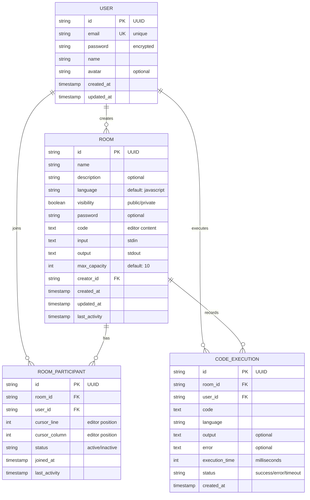

# CodeMitra Database Design

## Overview
CodeMitra uses PostgreSQL with Prisma ORM for database management. The database supports collaborative code editing with real-time collaboration features, user authentication, and code execution tracking.

---

## Entity Relationship Diagram



---

## Database Schema

### 1. **User Table** (`users`)
Stores user authentication and profile information.

| Column | Type | Constraints | Description |
|--------|------|-------------|-------------|
| `id` | UUID | PRIMARY KEY | Unique user identifier |
| `email` | VARCHAR | UNIQUE NOT NULL | User email address |
| `password` | VARCHAR | NOT NULL | Hashed password |
| `name` | VARCHAR | NOT NULL | User's display name |
| `avatar` | VARCHAR | NULLABLE | Profile picture URL |
| `created_at` | TIMESTAMP | DEFAULT now() | Account creation date |
| `updated_at` | TIMESTAMP | DEFAULT now() | Last profile update |

**Indexes:**
- `email` (UNIQUE)
- `id` (PRIMARY)

---

### 2. **Room Table** (`rooms`)
Stores collaborative coding rooms/sessions.

| Column | Type | Constraints | Description |
|--------|------|-------------|-------------|
| `id` | UUID | PRIMARY KEY | Room identifier |
| `name` | VARCHAR | NOT NULL | Room name/title |
| `description` | VARCHAR | NULLABLE | Room description |
| `language` | VARCHAR | DEFAULT 'javascript' | Programming language |
| `visibility` | BOOLEAN | DEFAULT true | Public/private room |
| `password` | VARCHAR | NULLABLE | Room access password (if private) |
| `code` | TEXT | DEFAULT '' | Current code in editor |
| `input` | TEXT | DEFAULT '' | Standard input for execution |
| `output` | TEXT | DEFAULT '' | Standard output from execution |
| `max_capacity` | INT | DEFAULT 10 | Maximum participants allowed |
| `creator_id` | UUID | FOREIGN KEY NOT NULL | Reference to User |
| `created_at` | TIMESTAMP | DEFAULT now() | Room creation date |
| `updated_at` | TIMESTAMP | DEFAULT now() | Last code update |
| `last_activity` | TIMESTAMP | DEFAULT now() | Timestamp of last activity |

**Indexes:**
- `creator_id` (FOREIGN KEY)
- `id` (PRIMARY)

**Foreign Keys:**
- `creator_id` → `users.id`

---

### 3. **RoomParticipant Table** (`room_participants`)
Tracks user participation in rooms and editor state (cursors).

| Column | Type | Constraints | Description |
|--------|------|-------------|-------------|
| `id` | UUID | PRIMARY KEY | Record identifier |
| `room_id` | UUID | FOREIGN KEY NOT NULL | Reference to Room |
| `user_id` | UUID | FOREIGN KEY NOT NULL | Reference to User |
| `cursor_line` | INT | DEFAULT 0 | Cursor line position |
| `cursor_column` | INT | DEFAULT 0 | Cursor column position |
| `status` | VARCHAR | DEFAULT 'active' | Participant status |
| `joined_at` | TIMESTAMP | DEFAULT now() | Join timestamp |
| `last_activity` | TIMESTAMP | DEFAULT now() | Last interaction time |

**Indexes:**
- `room_id` (FOREIGN KEY)
- `user_id` (FOREIGN KEY)
- `(room_id, user_id)` (UNIQUE composite)

**Foreign Keys:**
- `room_id` → `rooms.id` (ON DELETE CASCADE)
- `user_id` → `users.id`

**Unique Constraint:**
- `(room_id, user_id)` - Prevents duplicate participant entries

---

### 4. **CodeExecution Table** (`code_executions`)
Records execution history for audit and debugging purposes.

| Column | Type | Constraints | Description |
|--------|------|-------------|-------------|
| `id` | UUID | PRIMARY KEY | Execution record ID |
| `room_id` | UUID | FOREIGN KEY NOT NULL | Reference to Room |
| `user_id` | UUID | FOREIGN KEY NOT NULL | Reference to User |
| `code` | TEXT | NOT NULL | Code that was executed |
| `language` | VARCHAR | NOT NULL | Programming language |
| `output` | TEXT | NULLABLE | Execution output (stdout) |
| `error` | TEXT | NULLABLE | Error message if failed |
| `execution_time` | INT | NULLABLE | Execution time in ms |
| `status` | VARCHAR | NOT NULL | Status (success/error/timeout) |
| `created_at` | TIMESTAMP | DEFAULT now() | Execution timestamp |

**Indexes:**
- `room_id` (FOREIGN KEY)
- `user_id` (FOREIGN KEY)
- `created_at` (for queries by date)

**Foreign Keys:**
- `room_id` → `rooms.id` (ON DELETE CASCADE)
- `user_id` → `users.id`

---

## Relationships

### One-to-Many Relationships
1. **User → Room** (1 creator → many rooms)
   - A user creates multiple rooms
   - Relation: `User.createdRooms` ↔ `Room.creator`

2. **User → RoomParticipant** (1 user → many participations)
   - A user joins multiple rooms
   - Relation: `User.roomParticipants` ↔ `RoomParticipant.user`

3. **Room → RoomParticipant** (1 room → many participants)
   - A room has multiple participants
   - Relation: `Room.participants` ↔ `RoomParticipant.room`

4. **Room → CodeExecution** (1 room → many executions)
   - A room records multiple code executions
   - Relation: `Room.executions` ↔ `CodeExecution.room`

5. **User → CodeExecution** (1 user → many executions)
   - A user executes code multiple times
   - Relation: `User.codeExecutions` ↔ `CodeExecution.user`

---

## Key Features

### 1. **Real-time Collaboration**
- `RoomParticipant` tracks cursor positions for each user
- `last_activity` fields enable timeout detection
- Status field for presence awareness

### 2. **Execution History**
- `CodeExecution` table maintains execution logs
- Supports debugging and performance analysis
- Tracks individual user contributions

### 3. **Room Access Control**
- `visibility` flag for public/private rooms
- Optional `password` for private rooms
- Creator-based authorization

### 4. **Performance Tracking**
- `execution_time` records code performance
- `last_activity` for room analytics
- Cascade deletes for clean data management

---

## Constraints & Validations

### Unique Constraints
- `User.email` - Prevent duplicate accounts
- `RoomParticipant.(room_id, user_id)` - Prevent duplicate participations

### Foreign Key Constraints
- All foreign keys use UUID references
- Cascade deletes on Room/CodeExecution (clean removal when room deleted)
- Restrict deletes on User (preserve user records)

### NOT NULL Constraints
- All critical fields are NOT NULL
- Optional fields (avatar, password, description) are NULLABLE

---

## Indexes Strategy

### Current Indexes
1. **Primary Keys** - Implicit indexes on all `id` fields
2. **Foreign Keys** - Auto-indexed for join performance
3. **Unique Constraints** - Auto-indexed

### Recommended Additional Indexes (for optimization)
```sql
-- For finding rooms by creator
CREATE INDEX idx_rooms_creator_id ON rooms(creator_id);

-- For finding participant's active sessions
CREATE INDEX idx_room_participants_user_id ON room_participants(user_id);

-- For execution history queries
CREATE INDEX idx_code_executions_user_id ON code_executions(user_id);
CREATE INDEX idx_code_executions_created_at ON code_executions(created_at DESC);

-- For finding recent activity
CREATE INDEX idx_rooms_last_activity ON rooms(last_activity DESC);
```

---

## Data Retention Policy

### Suggested Retention Rules
- **Users**: Keep indefinitely (soft-delete recommended)
- **Rooms**: Keep for 1 year, then archive
- **RoomParticipants**: Delete when room is deleted
- **CodeExecutions**: Keep for 6 months, then move to archive table

---

## Scalability Considerations

### Current Limitations
- Single database instance
- No partitioning for large tables
- In-memory Redis for sessions (mentioned in code)

### Future Optimizations
1. **Partitioning**: Partition `code_executions` by date range
2. **Archiving**: Move old executions to separate table
3. **Caching**: Use Redis for active room metadata
4. **Read Replicas**: Add read replicas for scaling queries

---

## Migration History

| Migration | Date | Description |
|-----------|------|-------------|
| `20260221104344_init` | 2026-02-21 | Initial schema setup |

---

## Entity Definitions

### User Status Types
- `active` - Actively using the platform
- `inactive` - Temporarily inactive
- `suspended` - Account suspended

### Room Visibility
- `true` - Public (visible to all)
- `false` - Private (restricted access)

### Participant Status
- `active` - Currently in the room
- `inactive` - Temporarily away
- `disconnected` - Not connected but still a member

### Execution Status
- `success` - Code executed successfully
- `error` - Code execution failed with error
- `timeout` - Code execution timed out
- `pending` - Execution in progress

---

## Backup & Recovery

### Backup Strategy
- Daily automated backups to cloud storage
- Point-in-time recovery enabled
- Transaction logs retained for 30 days

### Recovery Procedures
1. Identify recovery point
2. Restore from backup
3. Apply transaction logs for incremental recovery
4. Verify data integrity

---

## Security Considerations

### Data Protection
- Passwords: Hashed with bcrypt (not stored as plain text)
- Room passwords: Encrypted at rest
- Sensitive data not logged in execution records

### Access Control
- User authentication via JWT
- Room-level permissions checked via `visibility` and `password`
- Creator-only modification rights

### Audit Trail
- `created_at` and `updated_at` timestamps on all entities
- `CodeExecution` table provides execution audit log
- `last_activity` timestamps for activity tracking

---

## SQL Schema Definition

```sql
-- Users table
CREATE TABLE users (
    id UUID PRIMARY KEY DEFAULT gen_random_uuid(),
    email VARCHAR UNIQUE NOT NULL,
    password VARCHAR NOT NULL,
    name VARCHAR NOT NULL,
    avatar VARCHAR,
    created_at TIMESTAMP DEFAULT CURRENT_TIMESTAMP,
    updated_at TIMESTAMP DEFAULT CURRENT_TIMESTAMP
);

-- Rooms table
CREATE TABLE rooms (
    id UUID PRIMARY KEY DEFAULT gen_random_uuid(),
    name VARCHAR NOT NULL,
    description VARCHAR,
    language VARCHAR DEFAULT 'javascript',
    visibility BOOLEAN DEFAULT true,
    password VARCHAR,
    code TEXT DEFAULT '',
    input TEXT DEFAULT '',
    output TEXT DEFAULT '',
    max_capacity INT DEFAULT 10,
    creator_id UUID NOT NULL REFERENCES users(id),
    created_at TIMESTAMP DEFAULT CURRENT_TIMESTAMP,
    updated_at TIMESTAMP DEFAULT CURRENT_TIMESTAMP,
    last_activity TIMESTAMP DEFAULT CURRENT_TIMESTAMP
);

-- Room participants table
CREATE TABLE room_participants (
    id UUID PRIMARY KEY DEFAULT gen_random_uuid(),
    room_id UUID NOT NULL REFERENCES rooms(id) ON DELETE CASCADE,
    user_id UUID NOT NULL REFERENCES users(id),
    cursor_line INT DEFAULT 0,
    cursor_column INT DEFAULT 0,
    status VARCHAR DEFAULT 'active',
    joined_at TIMESTAMP DEFAULT CURRENT_TIMESTAMP,
    last_activity TIMESTAMP DEFAULT CURRENT_TIMESTAMP,
    UNIQUE(room_id, user_id)
);

-- Code executions table
CREATE TABLE code_executions (
    id UUID PRIMARY KEY DEFAULT gen_random_uuid(),
    room_id UUID NOT NULL REFERENCES rooms(id) ON DELETE CASCADE,
    user_id UUID NOT NULL REFERENCES users(id),
    code TEXT NOT NULL,
    language VARCHAR NOT NULL,
    output TEXT,
    error TEXT,
    execution_time INT,
    status VARCHAR NOT NULL,
    created_at TIMESTAMP DEFAULT CURRENT_TIMESTAMP
);

-- Recommended indexes
CREATE INDEX idx_rooms_creator_id ON rooms(creator_id);
CREATE INDEX idx_room_participants_user_id ON room_participants(user_id);
CREATE INDEX idx_code_executions_user_id ON code_executions(user_id);
CREATE INDEX idx_code_executions_created_at ON code_executions(created_at DESC);
CREATE INDEX idx_rooms_last_activity ON rooms(last_activity DESC);
```

---

## Usage Examples

### Find all rooms created by a user
```sql
SELECT * FROM rooms WHERE creator_id = $1 ORDER BY created_at DESC;
```

### Find active participants in a room
```sql
SELECT u.id, u.name, rp.cursor_line, rp.cursor_column
FROM room_participants rp
JOIN users u ON rp.user_id = u.id
WHERE rp.room_id = $1 AND rp.status = 'active';
```

### Get code execution history for a room
```sql
SELECT ce.*, u.name
FROM code_executions ce
JOIN users u ON ce.user_id = u.id
WHERE ce.room_id = $1
ORDER BY ce.created_at DESC
LIMIT 50;
```

### Check room capacity
```sql
SELECT COUNT(*) as participant_count, r.max_capacity
FROM room_participants rp
JOIN rooms r ON rp.room_id = r.id
WHERE rp.room_id = $1
GROUP BY r.id;
```

---

## Notes

- All timestamps use UTC timezone
- UUIDs are generated using `gen_random_uuid()` for PostgreSQL
- Soft deletes can be implemented by adding an `is_deleted` flag if needed
- Consider implementing audit logging for sensitive operations
